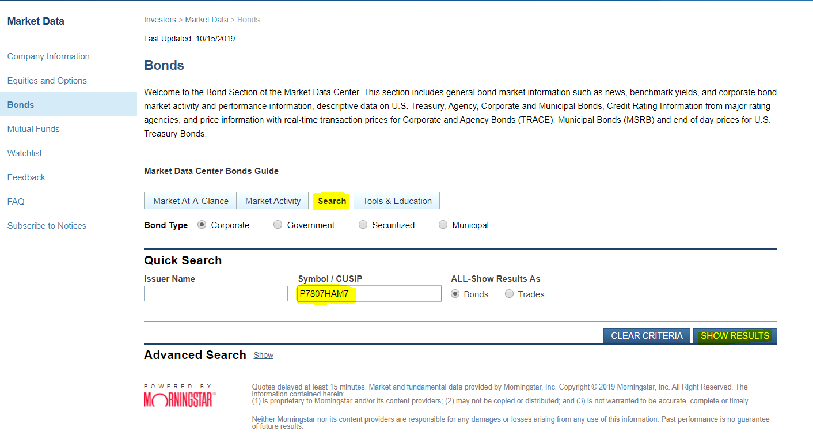
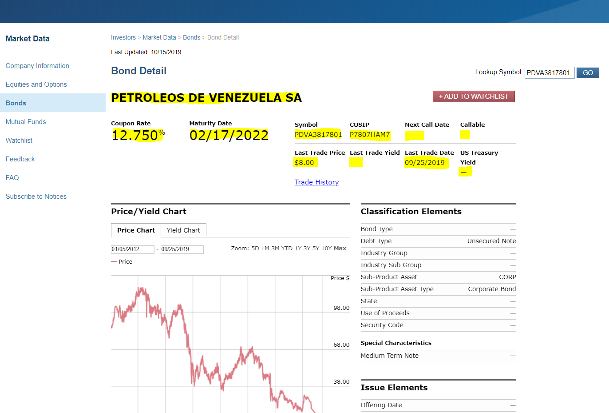
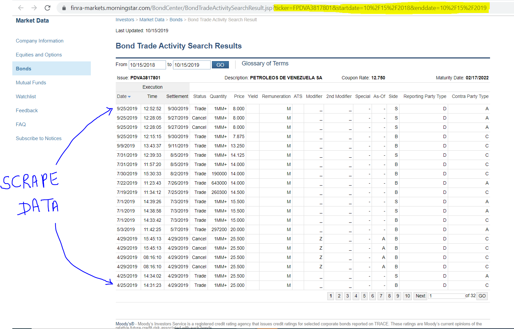

# FINRA-TRADE-DATA-SCRAPING

<B>This repository is for autonomous bot that scrapes Trade data from FINRA  using pyton & selenium for a given set of trade dates & CUSIPs.</B>

***Input: CSV File with 2 columns <TradeDate, CUSIP>***

***Output: CSV File with trade details containing:***
  - Trade Date
  - Time
  - Settlement Date
  - Quantity
  - Price
  - Yield
  - CUSIP
  - Bond Description
  - Symbol
  - Coupon Rate
  - Maturity Date
  - Moody Rating

## Finra Home Page

## Search a Bond

## Bond Description

The highlighted details are captured during the scraping process.

## Trade Details

 
